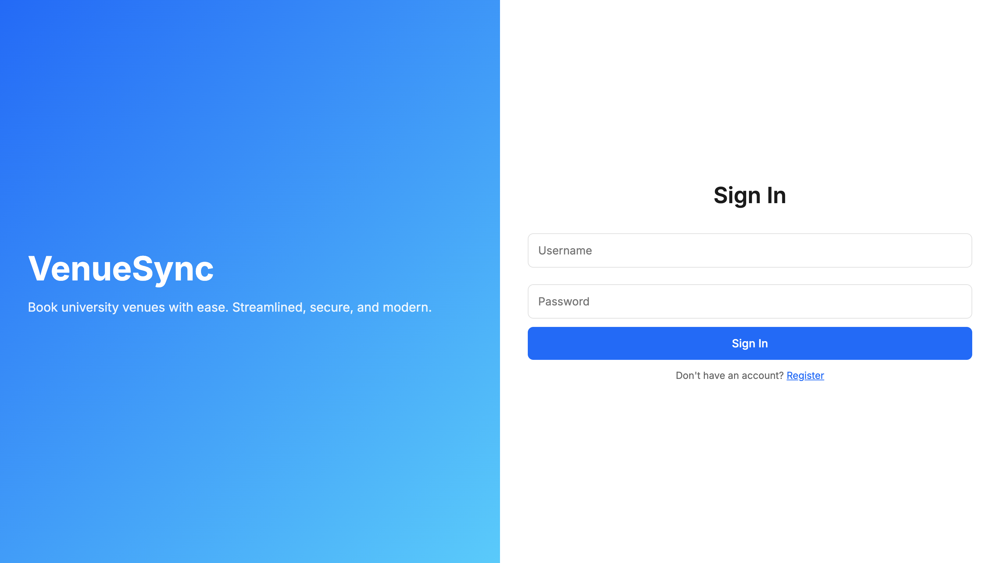
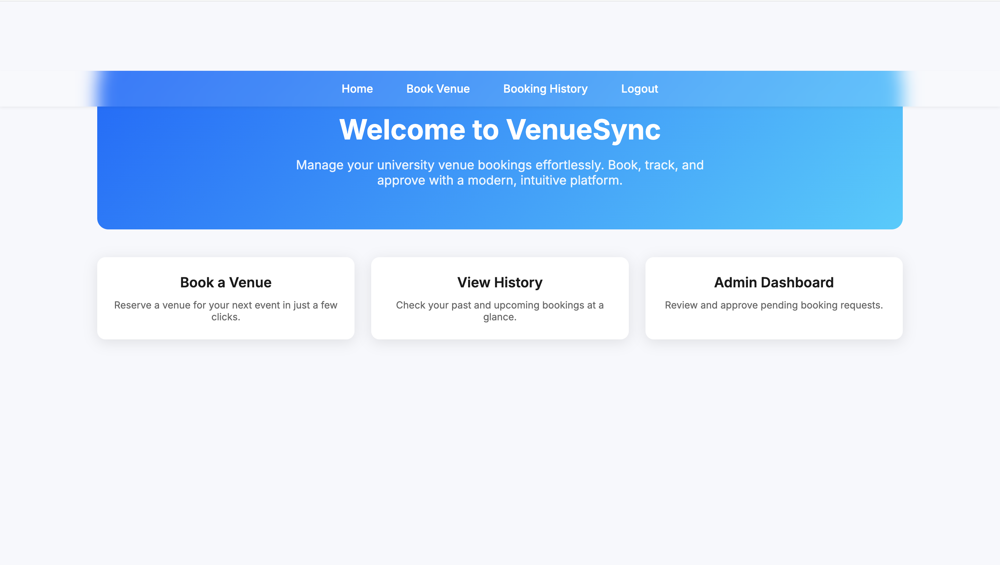
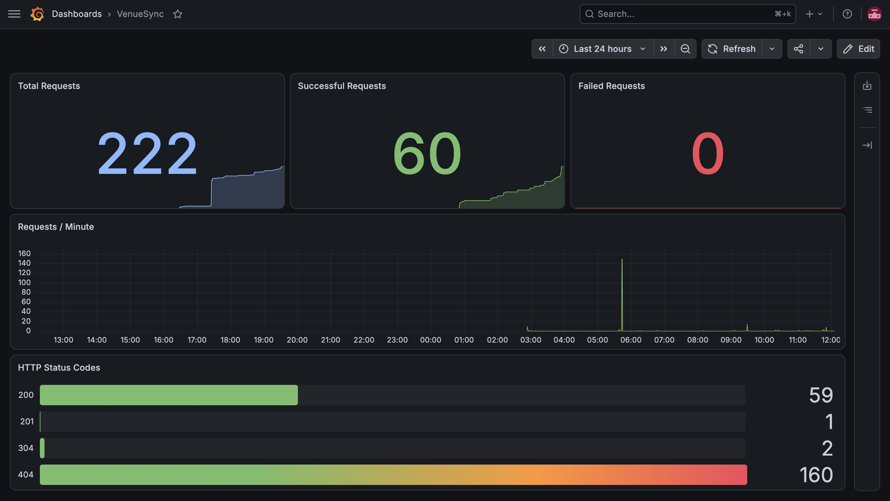

# VenueSync

VenueSync is a venue booking system for university spaces where users can check venue availability and submit booking requests, while administrators review and approve reservations. The application is built with Flask and MySQL, deployed on AWS EC2 using Docker Compose and Terraform, automated with GitHub Actions, and monitored using Prometheus and Grafana.

**Live:** https://venue-sync.duckdns.org

## Screenshots

| Login | Dashboard | Grafana |
|-------|-----------|----------|
|  |  |  |

## Features

- User registration and authentication
- Venue availability checking
- Venue booking and cancellation
- Admin approval workflow
- Docker Compose deployment
- Infrastructure provisioning with Terraform
- Automated CI/CD using GitHub Actions
- Monitoring with Prometheus and Grafana

## Tech Stack

| Layer | Technology |
|--------|------------|
| Backend | Flask (Python) |
| Database | MySQL |
| Reverse Proxy | Nginx |
| Containerization | Docker Compose |
| Infrastructure | Terraform |
| Cloud | AWS EC2 |
| CI/CD | GitHub Actions |
| Monitoring | Prometheus & Grafana |

## Architecture

```text
                    GitHub Actions
                           │
                           ▼
                        AWS EC2
                           │
Browser ── HTTPS ──► Nginx ─► Flask API ─► MySQL
                           │
                           ▼
                    Prometheus ─► Grafana
```

Five containers are defined in `docker-compose.yml`:

- MySQL
- Flask Application
- Nginx
- Prometheus
- Grafana

---

## Availability Checking

Double-booking prevention is handled directly within the SQL query instead of application logic.

```sql
SELECT v.id, v.name
FROM venues v
WHERE v.id NOT IN (
    SELECT b.venue_id
    FROM bookings b
    WHERE b.date = %s
      AND b.time = %s
      AND b.status != 'cancelled'
)
```

A venue already booked for the requested date and time is excluded from the results. Availability checking and booking creation occur within the same database operation, preventing race conditions between checking availability and reserving a venue.

---

## API

| Method | Endpoint | Notes |
|--------|----------|-------|
| POST | `/api/auth/register` | Register user |
| POST | `/api/auth/login` | Login |
| POST | `/api/auth/logout` | Logout |
| GET | `/api/venues/available` | `?date=&time=` |
| POST | `/api/bookings` | Create booking |
| GET | `/api/bookings` | Current user's bookings |
| DELETE | `/api/bookings/:id` | Pending bookings only |
| GET | `/api/bookings/pending` | Admin only |
| PATCH | `/api/bookings/:id/approve` | Admin only |

Authentication and authorization are implemented using the `@login_required` and `@admin_required` decorators. Requests to administrator-only endpoints by non-admin users receive a **403 Forbidden** response before the route logic executes.

---

## CI/CD

Every push to the `main` branch triggers a two-stage GitHub Actions workflow.

### Continuous Integration (CI)

- Lints the project using **flake8**
- Verifies the Flask application imports successfully
- Builds the Docker image

### Continuous Deployment (CD)

- Connects to the EC2 instance via SSH
- Pulls the latest source code
- Creates the `.env` file from GitHub Secrets
- Deploys the updated application using:

```bash
docker compose up -d --build
```

Workflow definition:

```
.github/workflows/deploy.yml
```

The CI pipeline validates code quality and build integrity. Automated integration and end-to-end tests are not currently implemented.

---

## Infrastructure

Infrastructure is provisioned using Terraform and consists of:

- AWS EC2 instance
- AWS Security Group

```hcl
resource "aws_instance" "venuesync_server" {
  ami           = "ami-0f58b397bc5c1f2e8"
  instance_type = "t3.small"

  root_block_device {
    volume_size = 20
    volume_type = "gp3"
  }
}
```

### Capacity Issue Encountered

The project was initially deployed on a **t3.micro** free-tier instance. After adding Prometheus and Grafana, memory usage increased to 905 MB / 911 MB (99%), causing the instance to become unresponsive because five Docker containers exceeded the available 1 GB RAM.

The issue was resolved by updating the Terraform configuration to provision a **t3.small** (2 GB RAM) instance with 20 GB gp3 storage, after which the application operated without further resource constraints.

---

## Monitoring

The Flask application exposes a `/metrics` endpoint using `prometheus-flask-exporter`. Prometheus scrapes the endpoint every **15 seconds**, while Grafana visualizes the collected metrics.

Dashboard panels include:

- Total requests
- Requests per minute
- Successful requests
- Failed requests
- Requests grouped by HTTP status code

Example PromQL queries:

```text
sum(flask_http_request_total)

sum(rate(flask_http_request_total[1m])) * 60

sum(flask_http_request_total{status=~"2.."})

sum(flask_http_request_total{status=~"4..|5.."})

sum by(status)(flask_http_request_total)
```

---

## Run Locally

```bash
git clone https://github.com/MujthabaT/VenueSync.git
cd VenueSync
nano .env
docker compose up -d
docker compose exec app python create_admin.py
```

Available services:

| Service | URL |
|---------|-----|
| Application | http://localhost |
| Grafana | http://localhost:3001 |
| Prometheus | http://localhost:9090 |

---

## Project Structure

```text
VenueSync/
├── .github/
│   └── workflows/
│       └── deploy.yml
├── public/
│   └── index.html
├── screenshots/
├── terraform/
├── app.py
├── create_admin.py
├── database.sql
├── docker-compose.yml
├── Dockerfile
├── nginx.conf
├── prometheus.yml
└── requirements.txt
```

---

## Author

- **GitHub:** https://github.com/MujthabaT
- **LinkedIn:** https://www.linkedin.com/in/mujthabat
